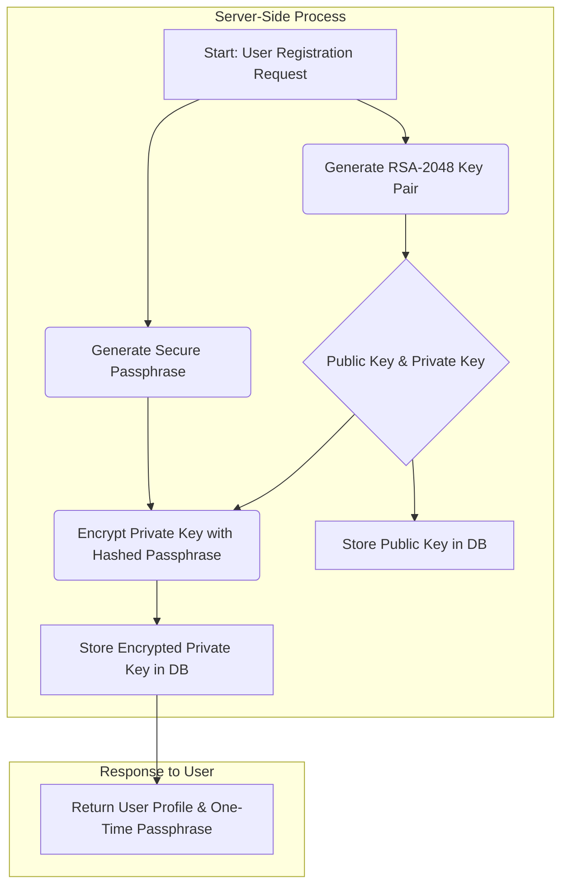
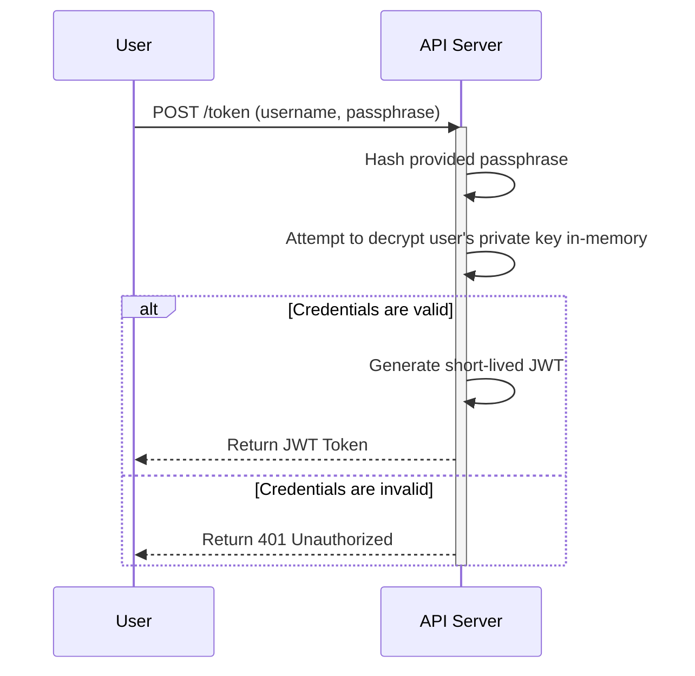
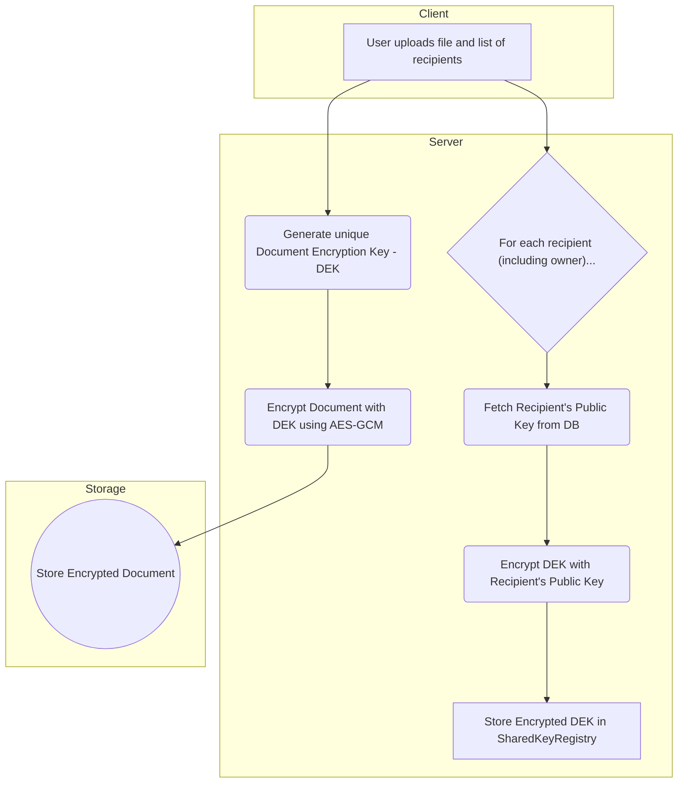
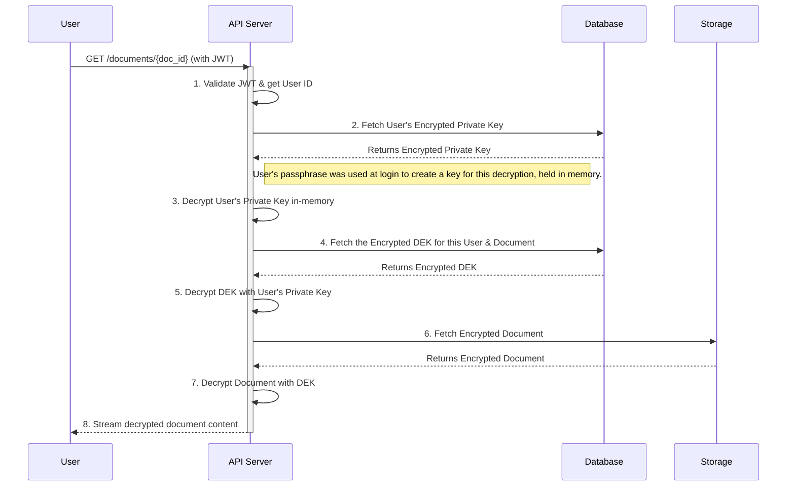

# DocumentAccessPOC

> A proof-of-concept secure document management system that solves the critical challenge of granular access control in organizational environments where traditional permission systems fall short.

[](https://python.org)
[](https://fastapi.tiangolo.com)
[](https://pypi.org/project/cryptography/)

## 📖 Table of Contents

- [DocumentAccessPOC](#documentaccesspoc)
  - [📖 Table of Contents](#-table-of-contents)
  - [🚩 Problem Statement](#-problem-statement)
  - [💡 Solution Overview](#-solution-overview)
  - [🌱 Project Genesis: Solving a Real-World Challenge](#-project-genesis-solving-a-real-world-challenge)
  - [✨ Key Features](#-key-features)
    - [🔒 End-to-End Encryption](#-end-to-end-encryption)
    - [🎯 Granular Access Control (Architectural)](#-granular-access-control-architectural)
    - [🚀 Secure Operations](#-secure-operations)
    - [🔐 Advanced Security](#-advanced-security)
  - [🏗️ Architecture](#️-architecture)
  - [🚀 Quick Start](#-quick-start)
    - [Prerequisites](#prerequisites)
    - [Installation](#installation)
    - [Configuration](#configuration)
    - [Running the Application](#running-the-application)
  - [⚙️ API Usage Examples](#️-api-usage-examples)
    - [1. User Registration \& Authentication](#1-user-registration--authentication)
    - [2. Document Operations](#2-document-operations)
  - [📚 API Reference](#-api-reference)
      - [Authentication](#authentication)
      - [Users](#users)
      - [Documents](#documents)
  - [🔐 Security Model](#-security-model)
    - [Cryptographic Flow](#cryptographic-flow)
    - [Access Control Matrix](#access-control-matrix)
    - [Security Guarantees](#security-guarantees)
  - [🆚 Positioning in the Security Landscape](#-positioning-in-the-security-landscape)
  - [⚠️ PoC Scope \& Production Considerations](#️-poc-scope--production-considerations)
  - [🗂️ Project Structure](#️-project-structure)
  - [🗺️ Extensibility and Roadmap](#️-extensibility-and-roadmap)
    - [Architectural Extensibility](#architectural-extensibility)
    - [Development Roadmap](#development-roadmap)
      - [Phase 1: Foundational Backend (✅ Completed in this PoC)](#phase-1-foundational-backend--completed-in-this-poc)
      - [Phase 2: Hardening for Production Backend](#phase-2-hardening-for-production-backend)
      - [Phase 3: Building the Full Application Ecosystem](#phase-3-building-the-full-application-ecosystem)
  - [❓ FAQ](#-faq)
  - [🙏 Acknowledgments](#-acknowledgments)
    - [A Note on Passphrase Generation](#a-note-on-passphrase-generation)
  - [📜 License](#-license)

---

## 🚩 Problem Statement

In modern organizations, controlling document access is complex and fraught with security risks. Traditional approaches like Role-Based Access Control (RBAC), file system permissions, and Access Control Lists (ACLs) struggle with:

-   **Overly Broad Access**: Developers and DevOps teams often have administrative access to everything, undermining confidentiality.
-   **Lack of Granularity**: Difficulty controlling access based on multiple dimensions (e.g., Teams, Projects, and Organization Levels).
-   **Document Duplication**: Sharing documents often requires creating multiple copies with different permissions, leading to versioning chaos.
-   **Scalability Issues**: Managing permissions becomes unmanageable as users and documents grow.
-   **Security Vulnerabilities**: System administrators can access sensitive content regardless of intended restrictions.

## 💡 Solution Overview

This project introduces a secure system where each document is encrypted with a unique key. Access is then managed through a central **SharedKeyRegistry**, which grants permissions on a per-user, per-document basis without ever exposing the document's content to the server.

✅ **Zero-Trust for Data at Rest**: Even system administrators cannot access document content without authorization.  
✅ **Granular Control Architecture**: The database schema is built for fine-grained permissions (see [Roadmap](#development-roadmap)).  
✅ **No Duplication**: A single encrypted document is stored, with access managed dynamically.  
✅ **Scalable by Design**: Efficiently manage permissions for thousands of users and documents.  
✅ **Secure Collaboration**: Multiple users can work on the same secure document version.

## 🌱 Project Genesis: Solving a Real-World Challenge

This project wasn't born from a theoretical exercise; it was created to solve a critical, real-world security gap encountered in modern software development.

> The journey began while a colleague was building an internal project management tool. The tool required a document storage system where teams (like Finance or HR) could upload highly sensitive files. The core problem was this: **how can you guarantee that sensitive documents are inaccessible even to the DevOps and Cloud Admins who manage the infrastructure?** With direct access to storage backends like AWS S3, traditional permissions are easily bypassed.

While concepts like using a Document Encryption Key (DEK) were known, existing systems didn't offer a clear solution for the most complex part: **managing access for multiple, specific users in a zero-trust way.**

The breakthrough came from tackling that multi-user challenge from first principles:
1.  A single, encrypted document should exist, avoiding duplication.
2.  To grant access, its unique DEK must be shared securely.
3.  Instead of sharing the DEK directly, it could be encrypted *separately* for each authorized user using their individual public key.
4.  A central registry could then map which users have access to which documents by storing these individually-encrypted DEKs.

This design elegantly solved the problem. Sharing a document with a new user becomes a lightweight operation of encrypting the DEK one more time, and revocation is as simple as deleting an entry—all without the server ever needing to see the plaintext keys.

Only after its conception was it clear that this independently-derived architecture aligns perfectly with robust industry best practices. It's a powerful implementation of what is known as **envelope encryption** combined with a **dynamic key registry** for cryptographic access control. This PoC serves as a blueprint for developers facing the same dilemma, demonstrating a practical path to building truly secure systems.

## ✨ Key Features

### 🔒 End-to-End Encryption
-   Documents are encrypted with a unique **Document Encryption Key (DEK)** using **AES-GCM**.
-   DEKs are securely exchanged using **RSA public key cryptography**.
-   Each user's private key is encrypted with a unique, strong passphrase.

### 🎯 Granular Access Control (Architectural)
The database schema is designed to support permissions based on:
-   **Teams**: e.g., DevOps, Finance, HR
-   **Projects**: e.g., P1, P2, P3
-   **Roles**: e.g., Lead, Admin, Member
*(Note: API endpoints for managing teams and projects are on the roadmap.)*

### 🚀 Secure Operations
-   **Upload**: Automatic encryption and access control setup.
-   **Share**: Dynamically grant access to other users without re-uploading.
-   **Revoke**: Instantly revoke access for any shared user.
-   **Delete**: Securely delete a document and all its associated keys.

### 🔐 Advanced Security
-   **JWT-based Stateless Authentication**: Secure and scalable authentication flow.
-   **SharedKeyRegistry**: Centralized, cryptographically-enforced permission management.
-   **No Passphrases over the Wire**: User passphrases are used only once to obtain a short-lived JWT, never for individual operations.

## 🏗️ Architecture

```
┌───────────────┐      ┌────────────────────┐      ┌───────────────────┐
│  User Client  │      │   FastAPI Server   │      │  Storage Backend  │
│               │◄────►│                    │◄────►│ (e.g., Local, S3) │
│  • JWT Token  │      │  • API Endpoints   │      │                   │
│               │      │  • JWT Validation  │      │  • Encrypted      │
└───────────────┘      │  • Access Logic    │      │    Documents      │
                       │  • Crypto Ops      │      │                   │
                       └────────────────────┘      └───────────────────┘
                                  │
                                  ▼
                      ┌───────────────────────┐
                      │       Database        │
                      │                       │
                      │  • Users              │
                      │  • Documents          │
                      │  • Public Keys        │
                      │  • SharedKeyRegistry  │
                      └───────────────────────┘
```

## 🚀 Quick Start

### Prerequisites
-   Python 3.10+
-   An SQL Database (defaults to SQLite)

### Installation
```bash
# Clone the repository
git clone https://github.com/subhayu99/DocumentAccessPOC
cd DocumentAccessPOC

# Set up virtual environment
python -m venv venv
source venv/bin/activate  # Windows: venv\Scripts\activate

# Install dependencies
pip install -r requirements.txt
```

### Configuration
1.  **Database**: The system defaults to a SQLite database in `./data/db.sqlite`. You can configure `DATABASE_URL` in `config.py` for PostgreSQL or other databases.
2.  **JWT Secret**: Change the `JWT_SECRET_KEY` in `config.py` for production use.

### Running the Application
```bash
# Start the server
uvicorn main:app --reload --port 8000
```
The API will be available at `http://localhost:8000`, with interactive docs at `http://localhost:8000/docs`.

## ⚙️ API Usage Examples

**Note:** The user's `parmanent_password` (passphrase) is **only** used to get a JWT. All subsequent requests are authenticated using the token in the `Authorization` header.

### 1. User Registration & Authentication
```bash
# Create a new user (Note: id can be any unique string, e.g., username)
curl -X POST "http://localhost:8000/users" \
     -H "Content-Type: application/json" \
     -d '{
       "id": "alice",
       "name": "Alice",
       "email": "alice@example.com",
       "designation": "Engineer"
     }'

# Response includes the one-time permanent password. Save it!
# {
#   "id": "alice",
#   "name": "Alice",
#   ...
#   "parmanent_password": "some-generated-secure-passphrase",
# }

# Get an authentication token using the user's ID and permanent password
curl -X POST "http://localhost:8000/token" \
     -H "Content-Type: application/x-www-form-urlencoded" \
     -d "username=alice&password=some-generated-secure-passphrase"
```

### 2. Document Operations
```bash
# Set your JWT for convenience
TOKEN="your-jwt-token-here"

# Upload and share a document with 'bob' and 'charlie'
curl -X POST "http://localhost:8000/documents?share_with=bob&share_with=charlie" \
     -H "Authorization: Bearer $TOKEN" \
     -F "file=@./report.pdf"

# Share an existing document with 'david'
curl -X PUT "http://localhost:8000/documents/{doc_id}/share?share_with=david" \
     -H "Authorization: Bearer $TOKEN"

# Download a document you have access to
curl -X GET "http://localhost:8000/documents/{doc_id}" \
     -H "Authorization: Bearer $TOKEN" \
     --output downloaded_report.pdf

# Revoke access for 'bob'
curl -X PUT "http://localhost:8000/documents/{doc_id}/revoke?revoke=bob" \
     -H "Authorization: Bearer $TOKEN"
```

## 📚 API Reference

#### Authentication
- `POST /users`: Create a new user account.
- `POST /token`: Authenticate and get a JWT token.

#### Users
- `GET /users/me`: Get the profile of the currently authenticated user.
- `GET /users`: Get public profiles of users by their IDs.

#### Documents
- `POST /documents`: Upload, encrypt, and share a new document.
- `GET /documents`: List all documents accessible to the current user.
- `GET /documents/{doc_id}`: Download and decrypt a document.
- `PUT /documents/{doc_id}/share`: Share a document with more users.
- `PUT /documents/{doc_id}/revoke`: Revoke user access from a document.
- `DELETE /documents/{doc_id}`: Securely delete a document.

## 🔐 Security Model

The security of this system is built on a robust cryptographic flow that ensures data confidentiality and enforces access control at every step. Even with full database and server access, an unauthorized party cannot read document content.

### Cryptographic Flow

Here is a breakdown of the key cryptographic operations.

<details>
<summary><strong>1. User Creation & Key Generation</strong>

When a new user is created, the server generates their cryptographic identity. The user's private key is immediately encrypted with a strong, unique passphrase that is returned to the user only once.</summary>


</details>

<details>
<summary><strong>2. User Authentication</strong>

The user's passphrase is **never** stored on the server. It is used only once during the login process to unlock a short-lived JWT, which is then used for all subsequent authenticated requests.</summary>


</details>

<details>
<summary><strong>3. Document Upload & Encryption</strong>

When a document is uploaded, it is encrypted with a brand new, single-use key (DEK). This DEK is then encrypted for the owner and each designated recipient using their respective public keys.</summary>


</details>

<details>
<summary><strong>4. Document Access & Decryption</strong>

To access a document, the server uses the user's credentials (from the JWT) to decrypt their private key in memory, which is then used to decrypt the document's specific DEK. This DEK is finally used to decrypt the document itself, which is streamed back to the user.</summary>


</details>

### Access Control Matrix

| Role        | Upload | Share | Revoke | Delete | Read Own | Read Shared |
| :---------- | :----: | :---: | :----: | :----: | :------: | :---------: |
| **Owner**   |   ✅   |  ✅   |   ✅   |   ✅   |    ✅    |     N/A     |
| **Shared User** |   ❌   |  ❌   |   ❌   |   ❌   |    ✅    |      ✅     |

### Security Guarantees
-   **Confidentiality**: Documents at rest are unreadable without authorization, even to system admins.
-   **Access Control**: Permissions are enforced cryptographically, not just via application logic.
-   **No Passphrase in Transit**: After initial login, only short-lived JWTs are transmitted.

## 🆚 Positioning in the Security Landscape

When solving a fundamental problem like secure data access, it's common for independent efforts to converge on similar architectural patterns. After developing this PoC, a review of the landscape shows that the core principles used here—like envelope encryption and cryptographic access control—are industry best practices, validating the soundness of the approach.

However, the *focus* and *purpose* of this project are fundamentally different from existing commercial applications. This PoC is not intended to be a feature-complete alternative to a platform like Tresorit or Nextcloud. Instead, its unique value lies in being a:

**Developer-centric, unopinionated, and self-hostable backend blueprint.**

The following comparison clarifies this distinction, showing how this project fills a specific niche for developers who need to build secure document functionality into their *own* applications, rather than adopting a monolithic, all-in-one platform.

| Feature / Aspect | DocumentAccessPOC (This PoC) | Commercial SaaS (e.g., Tresorit) | Open-Source Platform (e.g., Nextcloud) |
| :--- | :---: | :---: | :---: |
| **Security Model** | ✅ **Zero-Trust** | ✅ **Zero-Knowledge** | ✅ (With E2EE Module) |
| **Deployment Model** | **Self-Hosted API** | Managed SaaS | **Self-Hosted App** |
| **Granular Control** | ✅ (Architectural) | ✅ (Full UI) | ✅ (Full UI) |
| **Cryptographic Revocation** | ⚠️ Partial (No Key Rotation) | ✅ Complete | ⚠️ Partial / Complex |
| **Client-Side Keys** | ⚠️ Server-Side (In-Memory) | ✅ Yes | ✅ Yes |
| **Focus** | **Secure Backend/API** | **End-User Application** | **Full Collaboration Platform** |

**Key Takeaway:** This PoC serves as a foundational **secure backend**. Its purpose is to provide a clear, working model of the core cryptographic and access control logic that developers can learn from, adapt, and integrate into their own products.

## ⚠️ PoC Scope & Production Considerations

This project is a Proof-of-Concept designed to demonstrate a secure architectural pattern. The following table outlines key production-level features that were intentionally scoped out to maintain a tight focus on the core backend logic. It details the current PoC's behavior, the ideal production approach, and the rationale behind each scoping decision.

| Area / Feature | Current PoC Implementation | Production-Ready Approach | Scoping Rationale for PoC |
| :--- | :--- | :--- | :--- |
| **Cryptographic Revocation** | Removes user's key from the registry, preventing future API access. | **Key Rotation:** Re-encrypt the document with a new key and distribute it to remaining users. | This is a complex and computationally expensive workflow, outside the core goal of demonstrating the primary access and sharing mechanism. |
| **Private Key Handling** | Private key is briefly decrypted in server memory during authentication. | **Client-Side Cryptography:** All private key operations occur on the client (browser/app), achieving a full zero-knowledge architecture. | This requires a dedicated frontend application with crypto libraries. The PoC's focus was on the **backend API** that such a client would consume. |
| **Account Recovery** | None. A lost passphrase results in permanent data inaccessibility. | **User-Managed Recovery Key:** A one-time key is generated during onboarding that the user must save to restore access if their passphrase is lost. | This is an application-layer user flow, separate from the core cryptographic backend this PoC aims to demonstrate. |
| **Collaboration & Compliance** | No document versioning or audit trails are implemented. | **Dedicated Subsystems:** A robust versioning engine to prevent data loss and a tamper-resistant audit log for security and compliance. | These are both major subsystems. Implementing them would have detracted from the PoC's primary goal of proving the core zero-trust access model. |

## 🗂️ Project Structure
```
DocumentAccessPOC/
├── main.py                 # FastAPI application entry point
├── requirements.txt        # Python dependencies
├── config.py               # Configuration settings (DB, JWT, Storage)
├── models/                 # Data models and schemas (SQLModel)
├── helpers/                # Cryptographic utilities (AES, RSA, JWT)
├── backends/               # Storage and database backend abstractions
├── logic/                  # Business logic and dependencies
└── docs/                   # Additional documentation
```

## 🗺️ Extensibility and Roadmap

The architecture of this PoC was designed from the ground up for extensibility. The use of a `SharedKeyRegistry` and the existing database schema (which includes models for **Teams** and **Projects**) provides a strong foundation for building a production-grade service.

### Architectural Extensibility

The current design makes it straightforward to add more sophisticated features without a major overhaul:

*   **Granular Roles:** New access levels (e.g., "Editor," "Commenter," "Viewer") can be added by simply extending the `SharedKeyRegistry` with a `role` column. The API logic can then enforce permissions based on this role.
*   **Group-Based Permissions:** The groundwork is already laid for team- and project-based sharing. Building API endpoints to manage these groups and link them to documents is a logical next step.
*   **Attribute-Based Access:** In the future, the model could even be extended to support attribute-based access control (ABAC), where permissions are granted based on user attributes (e.g., "only users from the 'Finance' department in 'Europe' can access").

### Development Roadmap

The path from this PoC to a full-featured, production-ready system can be broken down into clear phases. This roadmap directly addresses the limitations outlined in the section above.

#### Phase 1: Foundational Backend (✅ Completed in this PoC)
-   [x] Core cryptographic engine using AES-GCM and RSA.
-   [x] Secure, per-user, per-document access control model.
-   [x] Stateless JWT-based authentication.
-   [x] Basic CRUD operations for users and documents.

#### Phase 2: Hardening for Production Backend
*This phase focuses on making the backend robust, secure, and ready for integration.*
-   [ ] **Implement Key Rotation:** Introduce a mechanism to re-encrypt documents for true cryptographic revocation when a user's access is removed.
-   [ ] **Comprehensive Audit Logging:** Create a tamper-resistant audit trail for all security-sensitive events (logins, shares, access, deletions).
-   [ ] **Document Versioning:** Build a system to manage document version history, preventing data loss in collaborative environments.
-   [ ] **Team & Project Management:** Implement the API endpoints to create, manage, and assign users to teams and projects, enabling group-based sharing.

#### Phase 3: Building the Full Application Ecosystem
*This phase focuses on building the user-facing components and enterprise-grade features.*
-   [ ] **Client-Side Crypto & UI:** Develop a frontend application (web, desktop, or mobile) that performs all private key operations locally. This achieves a full zero-knowledge architecture and is the most critical step for a production system.
-   [ ] **User-Friendly Account Recovery:** Implement a secure workflow for users to back up and use a one-time Recovery Key.
-   [ ] **SSO / LDAP Integration:** Allow users to authenticate using existing enterprise identity providers.
-   [ ] **Advanced Sharing Controls:** Add features like expiring links, password-protected public shares, and read-only access.

## ❓ FAQ

**Q: Can system administrators access document content?**  
A: No. Documents are encrypted at rest with keys that only authorized users can decrypt. Admins can manage the system but cannot read the content.

**Q: What happens if a user forgets their permanent password?**  
A: By design, their encrypted private key is irrecoverable. Access to their previously shared documents is lost. A new user profile would need to be created.

**Q: What encryption algorithms are used?**  
A: **AES-128-GCM** for document encryption (by default), **RSA-2048** for secure key exchange, and **SHA-256** for hashing. The user's passphrase is also hashed before being used to derive an encryption key.

## 🙏 Acknowledgments

Thanks to the **FastAPI** team and the contributors to the **PyCryptodome** and **Cryptography** libraries for their excellent tools.

### A Note on Passphrase Generation

The unique, one-time passphrases in this project are generated using a custom library, **BetterPassphrase**, also created by [me](https://github.com/subhayu99). It's designed to create secure, memorable passphrases from grammatically correct phrases.

**Key Features of BetterPassphrase:**

- **Secure & Memorable**: Generates grammatically correct phrases that are easier to remember than random strings.
- **Security Focused**: Includes entropy calculations to balance memorability with cryptographic strength.
- **Highly Customizable**: Control word count, separators, capitalization, and more.
- **Powerful CLI**: A full command-line interface for batch generation and file output.

You can check it out on [**PyPI**](https://pypi.org/project/BetterPassphrase/) or explore the source code on [**GitHub**](https://github.com/subhayu99/BetterPassphrase).

## 📜 License

This is a Proof-of-Concept project and is not currently available under a formal open-source license. It is intended for demonstration and educational purposes.
