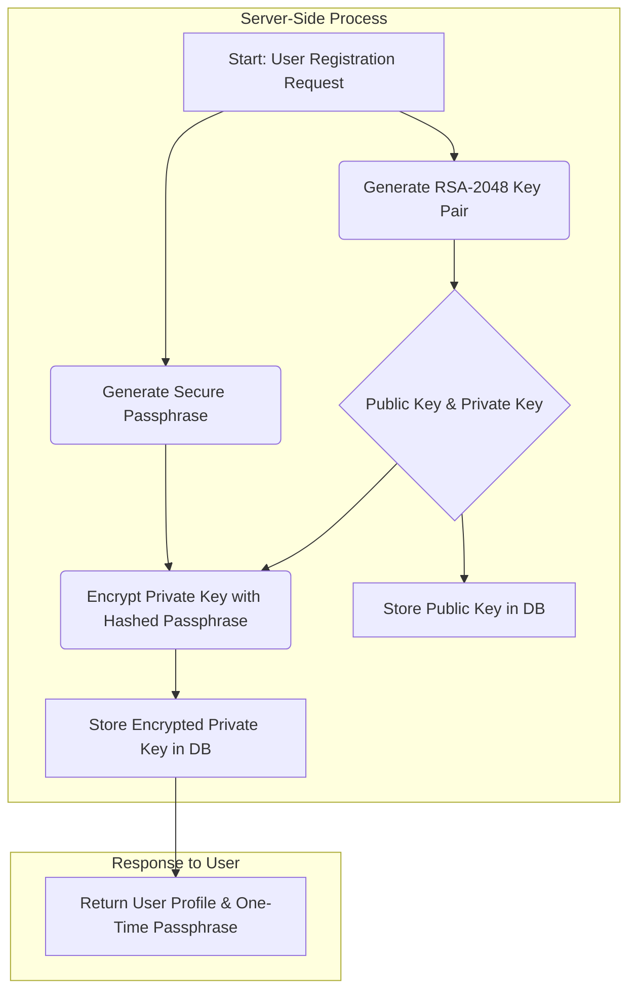
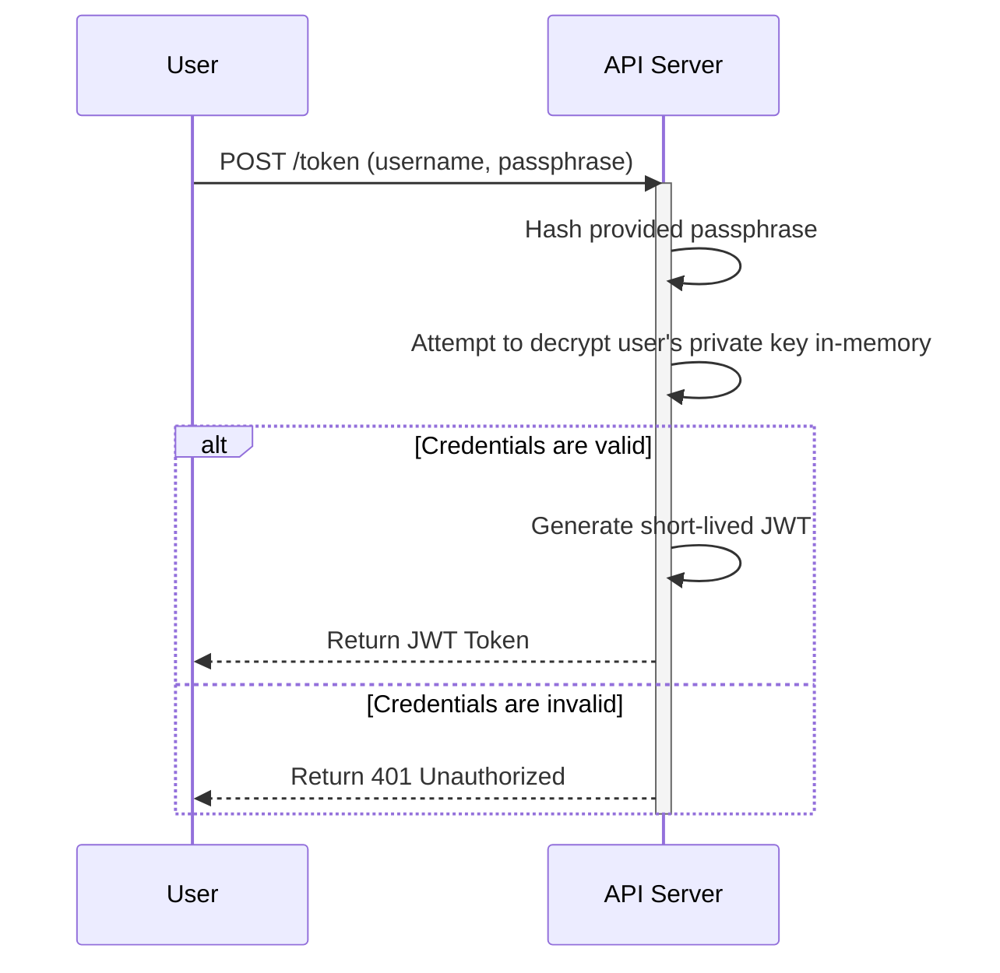
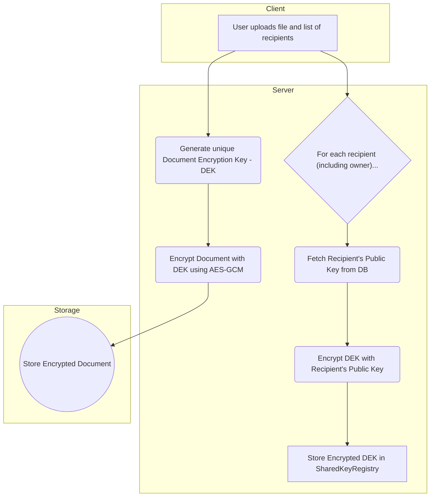
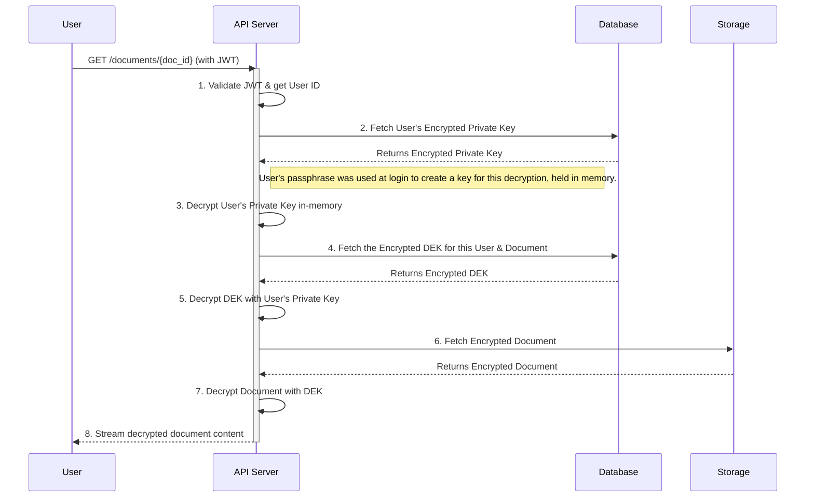

# DocumentAccessPOC

> A proof-of-concept secure document management system that solves the critical challenge of granular access control in organizational environments where traditional permission systems fall short.

[](https://python.org)
[](https://fastapi.tiangolo.com)
[](https://pypi.org/project/cryptography/)

## 📖 Table of Contents

- [DocumentAccessPOC](#documentaccesspoc)
  - [📖 Table of Contents](#-table-of-contents)
  - [🚩 Problem Statement](#-problem-statement)
  - [💡 Solution Overview](#-solution-overview)
  - [✨ Key Features](#-key-features)
    - [🔒 End-to-End Encryption](#-end-to-end-encryption)
    - [🎯 Granular Access Control (Architectural)](#-granular-access-control-architectural)
    - [🚀 Secure Operations](#-secure-operations)
    - [🔐 Advanced Security](#-advanced-security)
  - [🏗️ Architecture](#️-architecture)
  - [🚀 Quick Start](#-quick-start)
    - [Prerequisites](#prerequisites)
    - [Installation](#installation)
    - [Configuration](#configuration)
    - [Running the Application](#running-the-application)
  - [⚙️ API Usage Examples](#️-api-usage-examples)
    - [1. User Registration \& Authentication](#1-user-registration--authentication)
    - [2. Document Operations](#2-document-operations)
  - [reference API Reference](#reference-api-reference)
      - [Authentication](#authentication)
      - [Users](#users)
      - [Documents](#documents)
  - [🔐 Security Model](#-security-model)
    - [Cryptographic Flow](#cryptographic-flow)
    - [Access Control Matrix](#access-control-matrix)
    - [Security Guarantees](#security-guarantees)
  - [🆚 Advantages Over Traditional Approaches](#-advantages-over-traditional-approaches)
  - [🗂️ Project Structure](#️-project-structure)
  - [🌱 Extensibility and Roadmap](#-extensibility-and-roadmap)
    - [Roadmap](#roadmap)
      - [Phase 1 (Current PoC)](#phase-1-current-poc)
      - [Phase 2 (Future)](#phase-2-future)
      - [Phase 3 (Long-Term)](#phase-3-long-term)
  - [❓ FAQ](#-faq)
  - [🙏 Acknowledgments](#-acknowledgments)
    - [A Note on Passphrase Generation](#a-note-on-passphrase-generation)
  - [📜 License](#-license)

---

## 🚩 Problem Statement

In modern organizations, controlling document access is complex and fraught with security risks. Traditional approaches like Role-Based Access Control (RBAC), file system permissions, and Access Control Lists (ACLs) struggle with:

-   **Overly Broad Access**: Developers and DevOps teams often have administrative access to everything, undermining confidentiality.
-   **Lack of Granularity**: Difficulty controlling access based on multiple dimensions (e.g., Teams, Projects, and Organization Levels).
-   **Document Duplication**: Sharing documents often requires creating multiple copies with different permissions, leading to versioning chaos.
-   **Scalability Issues**: Managing permissions becomes unmanageable as users and documents grow.
-   **Security Vulnerabilities**: System administrators can access sensitive content regardless of intended restrictions.

## 💡 Solution Overview

This project implements a novel approach combining **encryption-based access control** with a **SharedKeyRegistry** to provide a robust and secure document management system.

✅ **Zero-Trust for Data at Rest**: Even system administrators cannot access document content without authorization.  
✅ **Granular Control Architecture**: The database schema is built for fine-grained permissions (see [Roadmap](#-extensibility-and-roadmap)).  
✅ **No Duplication**: A single encrypted document is stored, with access managed dynamically.  
✅ **Scalable by Design**: Efficiently manage permissions for thousands of users and documents.  
✅ **Secure Collaboration**: Multiple users can work on the same secure document version.

## ✨ Key Features

### 🔒 End-to-End Encryption
-   Documents are encrypted with a unique **Document Encryption Key (DEK)** using **AES-GCM**.
-   DEKs are securely exchanged using **RSA public key cryptography**.
-   Each user's private key is encrypted with a unique, strong passphrase.

### 🎯 Granular Access Control (Architectural)
The database schema is designed to support permissions based on:
-   **Teams**: e.g., DevOps, Finance, HR
-   **Projects**: e.g., P1, P2, P3
-   **Roles**: e.g., Lead, Admin, Member
*(Note: API endpoints for managing teams and projects are on the roadmap.)*

### 🚀 Secure Operations
-   **Upload**: Automatic encryption and access control setup.
-   **Share**: Dynamically grant access to other users without re-uploading.
-   **Revoke**: Instantly revoke access for any shared user.
-   **Delete**: Securely delete a document and all its associated keys.

### 🔐 Advanced Security
-   **JWT-based Stateless Authentication**: Secure and scalable authentication flow.
-   **SharedKeyRegistry**: Centralized, cryptographically-enforced permission management.
-   **No Passphrases over the Wire**: User passphrases are used only once to obtain a short-lived JWT, never for individual operations.

## 🏗️ Architecture

```
┌───────────────┐      ┌────────────────────┐      ┌───────────────────┐
│  User Client  │      │   FastAPI Server   │      │  Storage Backend  │
│               │◄────►│                    │◄────►│ (e.g., Local, S3) │
│  - JWT Token  │      │  • API Endpoints   │      │                   │
│               │      │  • JWT Validation  │      │  • Encrypted      │
└───────────────┘      │  • Access Logic    │      │    Documents      │
                       │  • Crypto Ops      │      │                   │
                       └────────────────────┘      └───────────────────┘
                                  │
                                  ▼
                      ┌───────────────────────┐
                      │       Database        │
                      │                       │
                      │  • Users              │
                      │  • Documents          │
                      │  • Public Keys        │
                      │  • SharedKeyRegistry  │
                      └───────────────────────┘
```

## 🚀 Quick Start

### Prerequisites
-   Python 3.8+
-   An SQL Database (defaults to SQLite)

### Installation
```bash
# Clone the repository
git clone https://github.com/your-username/DocumentAccessPOC
cd DocumentAccessPOC

# Set up virtual environment
python -m venv venv
source venv/bin/activate  # Windows: venv\Scripts\activate

# Install dependencies
pip install -r requirements.txt
```

### Configuration
1.  **Database**: The system defaults to a SQLite database in `./data/db.sqlite`. You can configure `DATABASE_URL` in `config.py` for PostgreSQL or other databases.
2.  **JWT Secret**: Change the `JWT_SECRET_KEY` in `config.py` for production use.

### Running the Application
```bash
# Start the server
uvicorn main:app --reload --port 8000
```
The API will be available at `http://localhost:8000`, with interactive docs at `http://localhost:8000/docs`.

## ⚙️ API Usage Examples

**Note:** The user's `parmanent_password` (passphrase) is **only** used to get a JWT. All subsequent requests are authenticated using the token in the `Authorization` header.

### 1. User Registration & Authentication
```bash
# Create a new user (Note: id can be any unique string, e.g., username)
curl -X POST "http://localhost:8000/users" \
     -H "Content-Type: application/json" \
     -d '{
       "id": "alice",
       "name": "Alice",
       "email": "alice@example.com",
       "designation": "Engineer"
     }'

# Response includes the one-time permanent password. Save it!
# {
#   "id": "alice",
#   "name": "Alice",
#   ...
#   "parmanent_password": "some-generated-secure-passphrase",
# }

# Get an authentication token using the user's ID and permanent password
curl -X POST "http://localhost:8000/token" \
     -H "Content-Type: application/x-www-form-urlencoded" \
     -d "username=alice&password=some-generated-secure-passphrase"
```

### 2. Document Operations
```bash
# Set your JWT for convenience
TOKEN="your-jwt-token-here"

# Upload and share a document with 'bob' and 'charlie'
curl -X POST "http://localhost:8000/documents?share_with=bob&share_with=charlie" \
     -H "Authorization: Bearer $TOKEN" \
     -F "file=@./report.pdf"

# Share an existing document with 'david'
curl -X PUT "http://localhost:8000/documents/{doc_id}/share?share_with=david" \
     -H "Authorization: Bearer $TOKEN"

# Download a document you have access to
curl -X GET "http://localhost:8000/documents/{doc_id}" \
     -H "Authorization: Bearer $TOKEN" \
     --output downloaded_report.pdf

# Revoke access for 'bob'
curl -X PUT "http://localhost:8000/documents/{doc_id}/revoke?revoke=bob" \
     -H "Authorization: Bearer $TOKEN"
```

## reference API Reference

#### Authentication
- `POST /users`: Create a new user account.
- `POST /token`: Authenticate and get a JWT token.

#### Users
- `GET /users/me`: Get the profile of the currently authenticated user.
- `GET /users`: Get public profiles of users by their IDs.

#### Documents
- `POST /documents`: Upload, encrypt, and share a new document.
- `GET /documents`: List all documents accessible to the current user.
- `GET /documents/{doc_id}`: Download and decrypt a document.
- `PUT /documents/{doc_id}/share`: Share a document with more users.
- `PUT /documents/{doc_id}/revoke`: Revoke user access from a document.
- `DELETE /documents/{doc_id}`: Securely delete a document.

## 🔐 Security Model

The security of this system is built on a robust cryptographic flow that ensures data confidentiality and enforces access control at every step. Even with full database and server access, an unauthorized party cannot read document content.

### Cryptographic Flow

Here is a breakdown of the key cryptographic operations.

<details>
<summary><strong>1. User Creation & Key Generation</strong>

When a new user is created, the server generates their cryptographic identity. The user's private key is immediately encrypted with a strong, unique passphrase that is returned to the user only once.</summary>


</details>

<details>
<summary><strong>2. User Authentication</strong>

The user's passphrase is **never** stored on the server. It is used only once during the login process to unlock a short-lived JWT, which is then used for all subsequent authenticated requests.</summary>


</details>

<details>
<summary><strong>3. Document Upload & Encryption</strong>

When a document is uploaded, it is encrypted with a brand new, single-use key (DEK). This DEK is then encrypted for the owner and each designated recipient using their respective public keys.</summary>


</details>

<details>
<summary><strong>4. Document Access & Decryption</strong>

To access a document, the server uses the user's credentials (from the JWT) to decrypt their private key in memory, which is then used to decrypt the document's specific DEK. This DEK is finally used to decrypt the document itself, which is streamed back to the user.</summary>


</details>

### Access Control Matrix

| Role        | Upload | Share | Revoke | Delete | Read Own | Read Shared |
| :---------- | :----: | :---: | :----: | :----: | :------: | :---------: |
| **Owner**   |   ✅   |  ✅   |   ✅   |   ✅   |    ✅    |     N/A     |
| **Shared User** |   ❌   |  ❌   |   ❌   |   ❌   |    ✅    |      ✅     |

### Security Guarantees
-   **Confidentiality**: Documents at rest are unreadable without authorization, even to system admins.
-   **Access Control**: Permissions are enforced cryptographically, not just via application logic.
-   **No Passphrase in Transit**: After initial login, only short-lived JWTs are transmitted.

## 🆚 Advantages Over Traditional Approaches

| Feature                | RBAC | File Permissions | ACLs | **DocumentAccessPOC** |
| :--------------------- | :--: | :--------------: | :--: | :-----------------------: |
| Granular Control       |  ❌  |        ❌        |  ⚠️   |             ✅            |
| No Admin Data Access   |  ❌  |        ❌        |  ❌  |             ✅            |
| No Document Duplication|  ✅  |        ❌        |  ❌  |             ✅            |
| Dynamic Sharing        |  ⚠️   |        ❌        |  ✅  |             ✅            |
| Cryptographic Security |  ❌  |        ❌        |  ❌  |             ✅            |

## 🗂️ Project Structure
```
DocumentAccessPOC/
├── main.py                 # FastAPI application entry point
├── requirements.txt        # Python dependencies
├── config.py               # Configuration settings (DB, JWT, Storage)
├── models/                 # Data models and schemas (SQLModel)
├── helpers/                # Cryptographic utilities (AES, RSA, JWT)
├── backends/               # Storage and database backend abstractions
├── logic/                  # Business logic and dependencies
└── docs/                   # Additional documentation
```

## 🌱 Extensibility and Roadmap

The system is designed for extension. The database already contains models for **Teams** and **Projects**, laying the groundwork for more complex permission structures.

### Roadmap

#### Phase 1 (Current PoC)
-   [x] Core cryptographic engine (AES & RSA)
-   [x] User-to-user document sharing
-   [x] JWT-based authentication
-   [x] Basic document CRUD operations

#### Phase 2 (Future)
-   [ ] Implement API endpoints for Team & Project management.
-   [ ] Introduce more user roles (e.g., "Commenter," "Editor").
-   [ ] Implement document versioning.
-   [ ] Add a comprehensive audit logging system.

#### Phase 3 (Long-Term)
-   [ ] SSO / LDAP integration.
-   [ ] Front-end UI application.
-   [ ] Zero-knowledge architecture (server never handles decrypted private keys).

## ❓ FAQ

**Q: Can system administrators access document content?**  
A: No. Documents are encrypted at rest with keys that only authorized users can decrypt. Admins can manage the system but cannot read the content.

**Q: What happens if a user forgets their permanent password?**  
A: By design, their encrypted private key is irrecoverable. Access to their previously shared documents is lost. A new user profile would need to be created.

**Q: What encryption algorithms are used?**  
A: **AES-128-GCM** for document encryption (by default), **RSA-2048** for secure key exchange, and **SHA-256** for hashing. The user's passphrase is also hashed before being used to derive an encryption key.

## 🙏 Acknowledgments

Thanks to the **FastAPI** team and the contributors to the **PyCryptodome** and **Cryptography** libraries for their excellent tools.

### A Note on Passphrase Generation

The unique, one-time passphrases in this project are generated using a custom library, **BetterPassphrase**, also created by [me](https://github.com/subhayu99). It's designed to create secure, memorable passphrases from grammatically correct phrases.

**Key Features of BetterPassphrase:**

- **Secure & Memorable**: Generates grammatically correct phrases that are easier to remember than random strings.
- **Security Focused**: Includes entropy calculations to balance memorability with cryptographic strength.
- **Highly Customizable**: Control word count, separators, capitalization, and more.
- **Powerful CLI**: A full command-line interface for batch generation and file output.

You can check it out on [**PyPI**](https://pypi.org/project/BetterPassphrase/) or explore the source code on [**GitHub**](https://github.com/subhayu99/BetterPassphrase).

## 📜 License

This is a Proof-of-Concept project and is not currently available under a formal open-source license. It is intended for demonstration and educational purposes.
