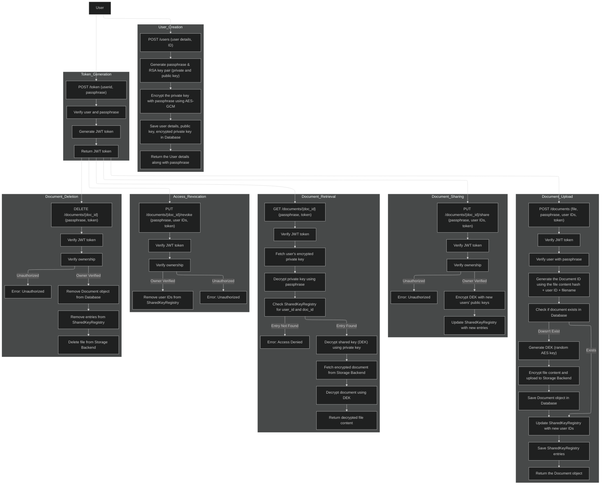

# API Flow

## Flow Diagram

---

## **Flow Overview:**

This flow diagram represents the interactions within the Document Management and Sharing API, including user creation, document upload, sharing, retrieval, access revocation, deletion, and token-based authentication.

1. **User Creation:**
   - A user is created via the `POST /users` route, where their basic details and ID are submitted.
   - The system generates a passphrase, RSA key pair, and encrypts the private key using AES-GCM.
   - The public key, encrypted private key, and other user details are saved in the database, and the user receives the necessary information, including the passphrase.

2. **Token Generation:**
   - The `POST /token` endpoint is used to authenticate the user by verifying their `userid` and `passphrase`.
   - If valid, a **JWT token** is generated and returned, which will be used in future requests for authentication.

3. **Document Upload:**
   - A user can upload a document using the `POST /documents` endpoint, where the document file, passphrase, and IDs of users with whom the document should be shared are provided.
   - The system verifies the JWT token, checks the user’s passphrase, and generates a Document ID based on the file content.
   - If the document already exists, it updates the sharing registry; otherwise, a new document is created, encrypted with a unique Document Encryption Key (DEK), and stored.
   - The DEK is then encrypted with the public keys of the users to share the document securely.

4. **Document Sharing:**
   - The `PUT /documents/{doc_id}/share` endpoint allows the owner of a document to share it with additional users.
   - The system verifies the JWT token and ownership before encrypting the DEK with the public keys of the new users and updating the SharedKeyRegistry.

5. **Document Retrieval:**
   - Users can retrieve documents via the `GET /documents/{doc_id}` endpoint by providing their passphrase and JWT token.
   - The system verifies the user’s token, decrypts their private key using the passphrase, and checks the SharedKeyRegistry for the document's access.
   - If access is granted, the encrypted document is fetched from the storage backend, decrypted using the DEK, and returned.

6. **Access Revocation:**
   - The owner can revoke access to a document using the `PUT /documents/{doc_id}/revoke` endpoint.
   - The system verifies the owner’s JWT token and removes the revoked user IDs from the SharedKeyRegistry.

7. **Document Deletion:**
   - The owner can delete a document using the `DELETE /documents/{doc_id}` endpoint.
   - The system verifies ownership and removes the document from the database, deletes entries from the SharedKeyRegistry, and removes the document from the storage backend.
